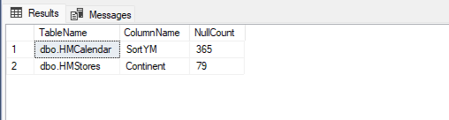
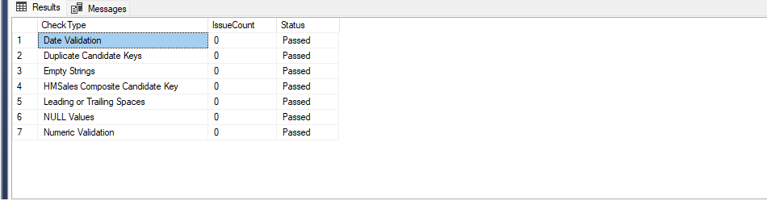
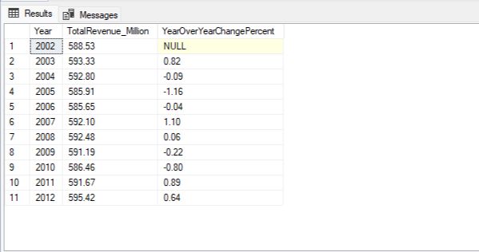
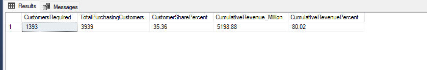
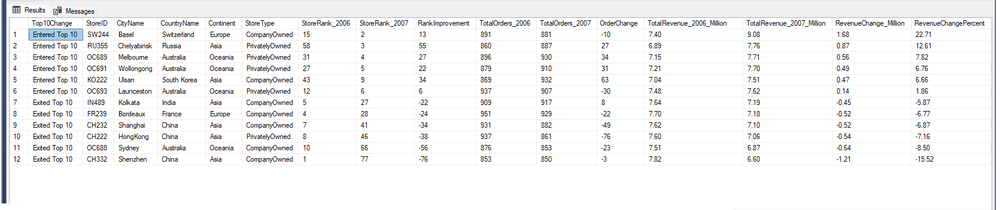
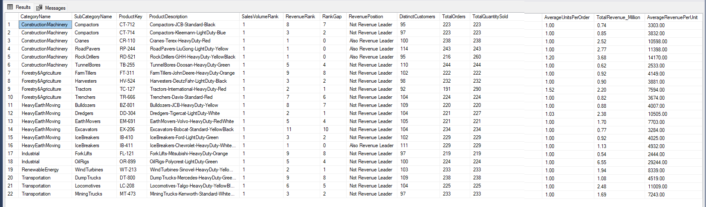
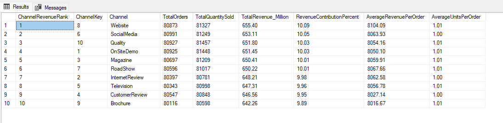
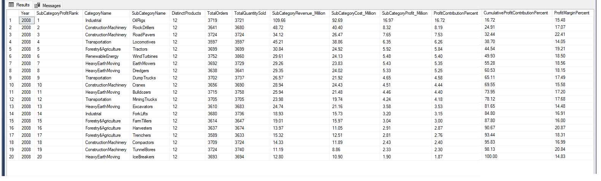
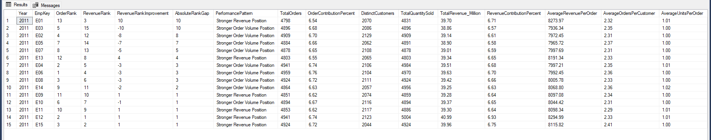

# Heavy Machinery Sales Analysis

## Project Overview

This project presents an end-to-end SQL analysis of a heavy machinery sales dataset using Microsoft SQL Server. The workflow covers data documentation, profiling, cleaning, validation, dataset exploration, and business analysis across time, customers, stores, products, sales channels, profitability, geography, and employee performance.

The objective is to demonstrate practical data-analyst skills, including:

- Translating business questions into SQL queries
- Validating data quality before analysis
- Cleaning inconsistent and incomplete source data
- Applying CTEs, dynamic SQL, joins, aggregations, and window functions
- Comparing rankings, contributions, trends, averages, medians, and cumulative metrics
- Converting query results into business insights and recommendations

## Tools and SQL Techniques

- Microsoft SQL Server
- SQL Server Management Studio (SSMS)
- Common table expressions (CTEs)
- Dynamic SQL with `sp_executesql`
- Window functions: `dense_rank`, `row_number`, and `lag`
- Aggregate functions and conditional logic
- Data-quality validation rules
- Pareto and cumulative-contribution analysis
- Average, median, margin, and year-over-year calculations

## Data Model

The dataset follows a hybrid star and snowflake structure.

- `HMSales` is the central fact table.
- `HMCustomers`, `HMStores`, `HMChannel`, and `HMCalendar` connect directly to the fact table.
- Product data is organized through `HMProducts`, `HMProductSubCategory`, and `HMProductCategory`.
- `Countries by Continents` is a geographic reference table used during cleaning and validation.

The source tables were imported without physical primary-key or foreign-key constraints. Candidate keys and relationships were therefore validated logically during profiling and exploration.

## Project Workflow

### 1. Data Dictionary

Documents the purpose, grain, candidate keys, relationships, important attributes, business uses, data-quality notes, and limitations of every table.

### 2. Data Profiling

Validates:

- NULL values
- Empty strings
- Leading and trailing spaces
- Duplicate candidate keys
- The composite candidate key of `HMSales`
- Numeric business rules
- Transaction and delivery-date consistency

The profiling script was run before cleaning to identify issues and again afterward to confirm the implemented corrections.

### 3. Data Cleaning

The cleaning process:

- Corrected imported column names in the geographic reference table
- Removed an incorrectly imported header row
- Rebuilt `HMCalendar.SortYM` in `YYYYMM` format
- Converted quarter values to `Q1` through `Q4`
- Standardized country names
- Populated missing store-continent values
- Corrected the misspelled city name `Brordeaux` to `Bordeaux`
- Revalidated all corrected fields

### 4. Business Analysis

The analytical scripts answer 14 primary business questions and several supporting questions across eight subject areas.

| File | Analysis Area | Questions |
|---|---|---|
| `04_01_Dataset_Exploration.sql` | Dataset structure and key identification | Q1 |
| `04_02_Time_Analysis.sql` | Revenue trends and strongest periods | Q2-Q2.3 |
| `04_03_Customer_Analysis.sql` | Customer value, concentration, and industries | Q3-Q4.1 |
| `04_04_Store_Analysis.sql` | Store rankings and year-to-year movement | Q5-Q6.1 |
| `04_05_Product_Analysis.sql` | Product popularity and revenue performance | Q7-Q8 |
| `04_06_Channel_Analysis.sql` | Sales-channel performance and trends | Q9-Q10.1 |
| `04_07_Profitability_and_Geographic_Analysis.sql` | Profitability and geographic customer performance | Q11-Q12.1 |
| `04_08_Employee_Analysis.sql` | Employee order and revenue performance | Q13-Q14.1 |

## Key Findings

- `HMSales` contains 806,485 product-line records and 806,311 distinct invoices.
- The combination of `Invoice` and `ProductKey` is a validated candidate key for the current sales data.
- Annual revenue remained stable across the 11 complete years from 2002 through 2012, with year-over-year changes between -1.16% and 1.10%.
- October 2007 produced the highest monthly revenue at 54.56 million.
- The top 10 customers contributed only about 1.06% of company revenue.
- Approximately 35.36% of purchasing customers were required to generate 80% of revenue, so the data did not follow the traditional 80/20 pattern.
- Resellers represented 90.68% of purchasing customers and generated 69.90% of revenue.
- Store rankings changed substantially between 2006 and 2007; the top 10 stores contributed only about 13% of annual revenue in each year.
- Only four sales-volume-leading products also ranked first in revenue within their subcategories.
- Revenue contribution was distributed very evenly across the ten sales channels, ranging from 9.89% to 10.09%.
- Website led revenue across the complete period, while Magazine led cumulatively during the latest five complete years.
- The most profitable complete year was 2008, generating 101.51 million in profit with a 17.13% margin.
- OilRigs was the highest-profit product subcategory, but RoadPavers achieved the highest subcategory profit margin.
- The United States recorded the highest country-level peak spending and combined strong market scale with high average customer value.
- Employee order and revenue performance was relatively balanced in 2011, and order rank did not always align with revenue rank.

## Selected Results

### Data Quality Validation

Initial profiling identified 365 missing `SortYM` values in `HMCalendar` and 79 missing `Continent` values in `HMStores`.



After cleaning, all seven profiling categories returned zero issues and passed validation.



### Annual Revenue Trend

Annual revenue remained highly stable from 2002 through 2012. Year-over-year changes ranged from -1.16% to 1.10%, indicating consistent sales performance without major annual volatility.



### Customer Revenue Concentration

The analysis showed that 1,393 customers, representing 35.36% of all purchasing customers, were required to generate approximately 80% of total revenue. This indicates a broader revenue distribution than the traditional 80/20 Pareto pattern.



### Store Ranking Movement

Store rankings changed substantially between 2006 and 2007. Six stores entered the top 10 while six others exited, demonstrating meaningful year-to-year movement despite relatively stable company-wide revenue.



### Product Sales Volume vs. Revenue

The comparison showed that a product leading its subcategory in sales volume was not necessarily the revenue leader. Only four sales-volume-leading products also ranked first in revenue within their subcategories.



### Sales Channel Performance

Revenue was distributed almost evenly across all ten sales channels, with contribution shares ranging from 9.89% to 10.09%. Website ranked first overall, but the small differences indicate that no single channel dominated revenue.



### Profitability by Product Subcategory

OilRigs generated the highest subcategory profit at 16.97 million and contributed 16.72% of total profit in 2008. RoadPavers achieved the highest profit margin among the subcategories at 22.41%.



### Employee Order vs. Revenue Performance

Employee rankings by order volume did not always align with rankings by revenue. This comparison highlights employees whose revenue position was stronger or weaker than their order-volume position.



## Repository Structure

```text
Heavy-Machinery-SQL-Analysis/
|
|-- README.md
|-- data/
|   `-- source-data-or-download-instructions
|-- docs/
|   `-- 01_Data_Dictionary.md
|-- SQL/
|   |-- 02_Data_Profiling.sql
|   |-- 03_Data_Cleaning.sql
|   |-- 04_01_Dataset_Exploration.sql
|   |-- 04_02_Time_Analysis.sql
|   |-- 04_03_Customer_Analysis.sql
|   |-- 04_04_Store_Analysis.sql
|   |-- 04_05_Product_Analysis.sql
|   |-- 04_06_Channel_Analysis.sql
|   |-- 04_07_Profitability_and_Geographic_Analysis.sql
|   `-- 04_08_Employee_Analysis.sql
`-- images/
    `-- selected-query-results-and-data-model-images
```

## Execution Order

1. Import the source tables into SQL Server.
2. Review `docs/01_Data_Dictionary.md`.
3. Run `SQL/02_Data_Profiling.sql` on the imported data.
4. Run `SQL/03_Data_Cleaning.sql` once on the original imported dataset.
5. Run `SQL/02_Data_Profiling.sql` again to validate the cleaned data.
6. Run the eight `SQL/04_*` analytical scripts in numerical order.

> **Important:** The cleaning script contains operations that rename, drop, and recreate columns. It is designed to be executed once on the original imported dataset.

## Metric Definitions

- Revenue = Quantity Sold x Unit Selling Price
- Total Cost = Quantity Sold x Unit Cost
- Profit = Quantity Sold x (Unit Selling Price - Unit Cost)
- Profit Margin = Profit / Revenue x 100
- One distinct `Invoice` represents one customer order.
- Complete-year analysis includes only years with sales activity in all 12 months.

## Limitations

- The source tables do not contain enforced primary-key or foreign-key constraints.
- The dataset does not include marketing costs, customer acquisition costs, inventory levels, or store operating expenses.
- Employee information is limited to `EmpKey`; names, roles, territories, and compensation are unavailable.
- Revenue and order rankings do not independently measure profitability, customer satisfaction, service quality, or causal performance.
- Historical patterns should not be treated as forecasts without additional validation.

## Author

Created as a SQL data-analysis portfolio project.
